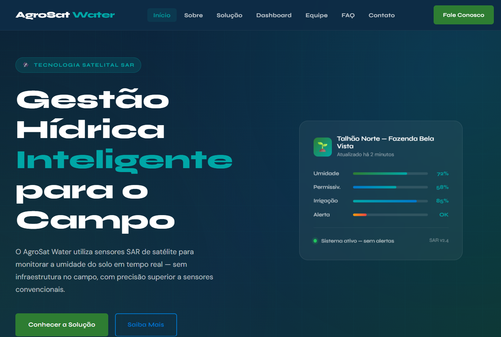
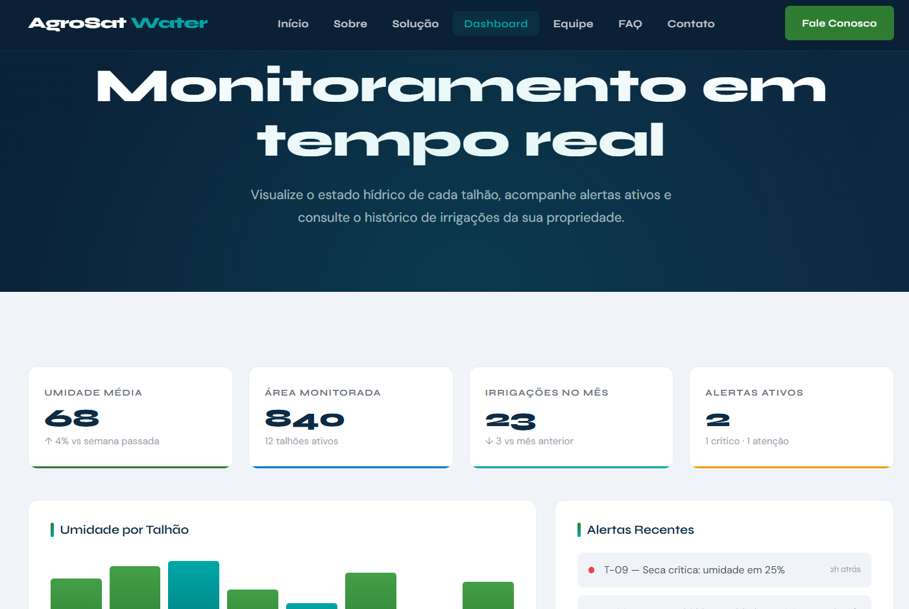
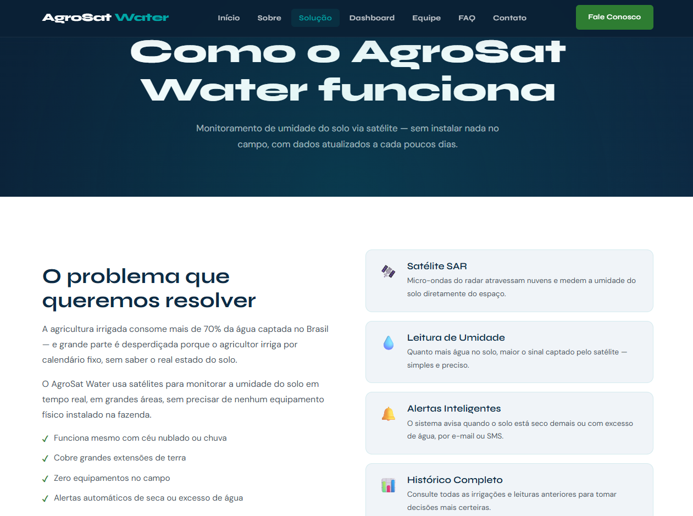
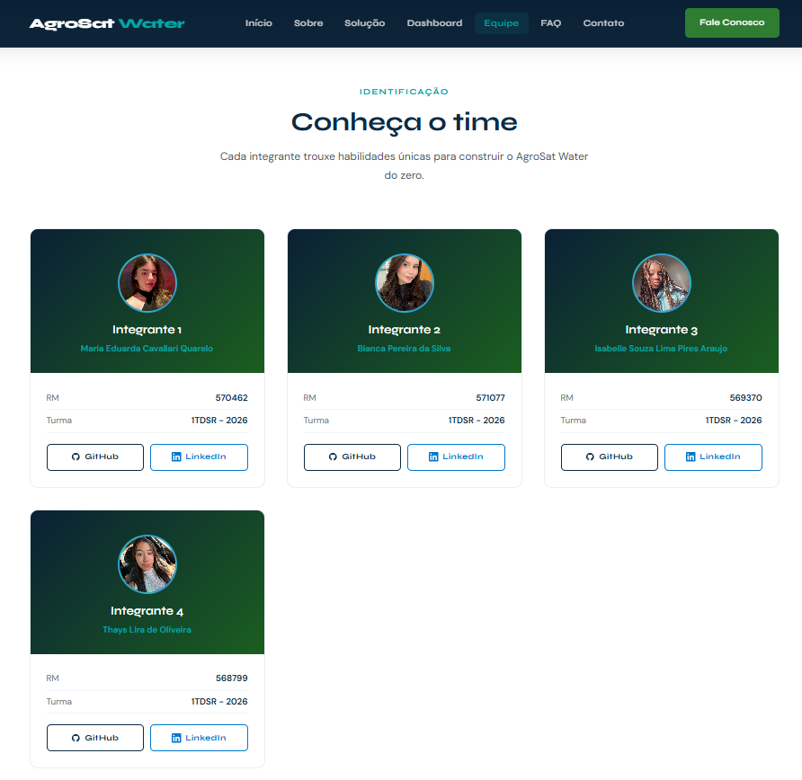

# 🌿 AgroSat Water


## 📌 Sobre o Projeto
 
O **AgroSat Water** é uma solução desenvolvida para a **Global Solution 2026** da FIAP, com o tema **Space Connect**. O projeto utiliza sensores SAR (Synthetic Aperture Radar) de satélite para monitorar a umidade do solo em tempo real, entregando recomendações de irrigação precisas aos agricultores, sem depender de sensores físicos no campo.
 
Este repositório contém o **Front-End** do projeto: um site completo que apresenta a solução, seus diferenciais, dashboard de monitoramento, equipe e canais de contato.
 
---

## 🚀 Funcionalidades
 
- **Página Inicial** — apresentação da proposta e da tecnologia SAR
- **Sobre** — contexto do problema e como o AgroSat Water resolve
- **Solução** — detalhamento técnico da plataforma
- **Dashboard** — painel de monitoramento de umidade, irrigação e alertas
- **Equipe** — apresentação das integrantes do projeto
- **FAQ** — perguntas frequentes sobre o sistema
- **Contato** — formulário para contato


---

## 🔗 Repositório
 
[https://github.com/dudaquarelo/agrosatwater-project](https://github.com/dudaquarelo/agrosatwater-project)
 
---

---


## 🖼️ Imagens e Ícones


**Página Inicial**

 
**Dashboard**

 
**Solução**

 
**Equipe**



---


## 🗂️ Estrutura do Projeto
 
```
agrosat-water-global-solution/
│
├── README.md             # Documentação do projeto
├── assets/               # Imagens, ícones e logo
│   ├── logo.png
│   ├── icon.png
│   ├── foto_bianca.JPEG
│   ├── foto_duda.jpeg
│   ├── foto_isa.jpeg
│   ├── foto_thays.jpeg
│   ├── home.png
│   ├── dashboard.png
│   ├── solucao.png
│   └── equipe.png
│
├── css/                  # Estilos separados por componente/página
│   ├── global.css
│   ├── variaveis.css
│   ├── header.css
│   ├── footer.css
│   ├── index.css
│   ├── sobre.css
│   ├── paginas.css
│   ├── integrantes.css
│   ├── contato.css
│   ├── faq.css
│   ├── style.css
│   └── responsivo.css
│
├── js/                   # Scripts JavaScript
│
├── index.html            # Página inicial
├── sobre.html            # Sobre o projeto
├── solucao.html          # A solução
├── dashboard.html        # Dashboard de monitoramento
├── integrantes.html      # Equipe
├── faq.html              # Perguntas frequentes
└── contato.html          # Contato
```
 
---


